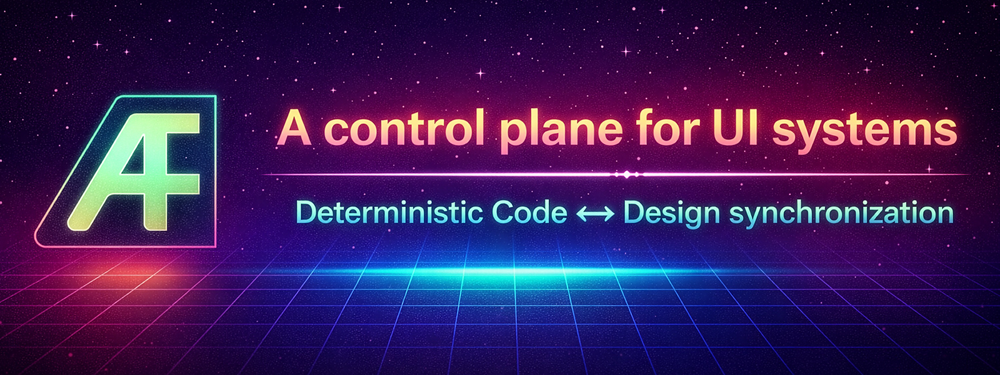

<p align="center">
  
</p>

<h1 align="center">Aesthetic Function</h1>

<p align="center">
  <strong>The control plane for AI-driven UI development</strong>
</p>

<p align="center">
  Framework-aware Code ↔ Design synchronization for React, Vue, and Figma
</p>

<br/>

---

Aesthetic Function (AF) is a system for keeping UI source code and design representations in sync — continuously and deterministically, without prompt engineering.

AF uses **framework analyzers** to extract intent from source code and reconcile it with design state. React/JSX supports the full existing reconciliation workflow. Vue 3 Single File Components are supported as a read-only framework analyzer in this first release, with source write-back intentionally gated behind a future round-trip safety spike.

As AI-generated UI accelerates, alignment between code and design becomes harder — not easier.

AF makes that alignment a **system**, not a workflow.

This is a new category: a control plane for UI systems.

AF is not a design tool. It is not a code generator.

It is the system that keeps them aligned over time.

## Demo

<p align="center">
  <strong>Change code or design — AF keeps them aligned automatically.</strong>
</p>

https://github.com/user-attachments/assets/7842cacb-3759-4794-b350-716b2bc15766

## Why Now

AI can generate UI instantly.

But it cannot keep code and design aligned over time.

That gap creates:
- drift
- inconsistencies
- broken design systems
- manual cleanup work

AF solves the **post-generation problem**:
keeping UI systems coherent after they are created.

## The Problem

Design–dev drift is the slow divergence between what designers build in Figma and what developers ship in code. Every team experiences it. Most "solutions" are either:

- **Manual** — designers and developers eyeball differences and file tickets
- **Prompt-to-code** — AI generates code from screenshots, losing fidelity and context
- **One-shot exports** — tools export design tokens once, with no ongoing sync

None of these are *systems*.

They don't reconcile.
They don’t detect drift.
They don’t maintain alignment over time.

## What AF Does Differently

Think of AF as:

> Git for UI state — across code and design.

AF introduces a deterministic reconciliation model:

- Code defines structure
- Design defines visual overrides
- Conflicts are resolved with explicit precedence rules

```
Code Change → Watcher → Reconciliation → Server → Figma Plugin → Figma Update
                                ↑
Design Change → Plugin → Server → Override Capture → Reconciliation (next save)
```

This is a **continuous bidirectional loop**, not a one-shot export.

It does not export design to code.

It keeps them in sync continuously.

### Framework-Aware Source Analysis

AF dispatches source files to the appropriate framework analyzer based on extension. Each analyzer emits the same framework-neutral intent model — the reconciliation, token resolution, and Figma operation layers are unaware of the source language.

| Source surface | Status |
|---|---|
| React / JSX / TSX | Full supported workflow — reconciliation, write-back, drift analysis |
| Vue 3 Single File Components | Read-only analyzer — code-to-design intent extraction, no source write-back |
| Svelte / Solid / Astro | Future analyzer targets |

### Key Properties

| Property | What it means |
|----------|---------------|
| **Deterministic** | Same inputs always produce the same outputs. No LLM in the critical path (optional, with fallback). |
| **Reconciled** | Design overrides, code markers, AST values, and defaults are merged with explicit precedence: `override > marker > ast > code`. |
| **Auditable** | Every operation produces artifacts. Every decision is traceable. CI gates enforce drift thresholds. |
| **Safe** | Dry-run by default. Opt-in writes. Echo suppression prevents feedback loops. Rollback previews before destructive changes. |
| **Read-only adapters** | External integrations (Figma MCP, Storybook MCP) are read-only with default-deny tool policies. Adapters are classified by surface type, access mode, authority role, and stability. AF is the only mutation authority. |

### How It Differs From…

| Approach | AF's difference |
|----------|-----------------|
| **Prompt-to-code** (v0, Bolt, etc.) | AF doesn't generate code from designs. It *reconciles* code and design as a continuous system. |
| **Design token export** (Style Dictionary, etc.) | AF goes beyond tokens — it syncs component structure, variants, states, and properties bidirectionally. |
| **MCP integrations** (figma-console-mcp, etc.) | AF uses MCP as a *read-only data source*, never as a mutation path. AF's control plane is watcher → server → plugin. |
| **Storybook MCP** (@storybook/addon-mcp) | AF connects to Storybook's MCP endpoint to read component metadata for cross-surface drift analysis — it does not run or control Storybook. |
| **Figma plugins** (code-gen plugins) | AF's plugin is a *mutation executor*, not a decision-maker. Reconciliation happens in the watcher. |

## Architecture

Three runtimes with strict boundaries:

```
┌─────────────────┐   HTTP/WS   ┌─────────────────┐   WebSocket   ┌─────────────────┐
│     Watcher      │ ──────────▶ │     Server       │ ────────────▶ │  Figma Plugin    │
│  (Reconciliation │ ◀────────── │  (Relay + Audit) │ ◀──────────── │  (Mutation Only) │
│   + Analysis)    │             │                  │               │                  │
└─────────────────┘             └─────────────────┘               └─────────────────┘
       │                                │                                  │
   watches code                   persists audit                    mutates Figma
   resolves fields                logs + overrides                  scene graph
   runs adapters
```

| Runtime | Responsibility | Cannot do |
|---------|---------------|-----------|
| **Watcher** | Reconciliation, framework analysis, adapter reads, token resolution | Write to Figma directly |
| **Server** | Message relay, audit logging, override persistence | Interpret UI meaning |
| **Plugin** | Execute Figma mutations, report selections | Access filesystem, make network calls (in code.ts) |

> For detailed runtime boundaries, reconciliation semantics, and phase-by-phase implementation details, see [docs/architecture-reference.md](docs/architecture-reference.md).

## Quick Start

### Prerequisites

- Node.js 18+
- pnpm
- Figma desktop app

### Install and Run

```bash
git clone <repo-url>
cd aesthetic-function
pnpm install

# Start the system
pnpm dev:server     # Terminal 1: relay server on :3001
pnpm dev:watcher    # Terminal 2: file watcher

# For Figma plugin access (plugins can't reach localhost):
pnpm tunnel         # Terminal 3: cloudflared tunnel
```

### Load the Figma Plugin

1. In Figma: **Plugins → Development → Import plugin from manifest...**
2. Select `packages/figma-plugin/manifest.json`
3. Run the plugin, paste your tunnel URL, click **Connect**

### Run Reconciliation

```bash
# React demo
af reconcile demos/react-demo-app/src/App.tsx

# Vue demo (read-only analyzer — write-back disabled in first Vue release)
af reconcile demos/vue-demo-app/src/App.vue --no-write

# Check drift status
af status demos/react-demo-app/src/App.tsx

# Project-wide dashboard
af dashboard --project demos/react-demo-app/src/
```

> **Vue note:** Vue source write-back is disabled in the first Vue adapter release. Use `--no-write` for Vue workflows until the write-back spike is completed.

### Configure

```bash
# Generate config file
af init

# Set a policy profile
af init --profile balanced
```

Available profiles: `designer-first`, `code-first`, `balanced`, `strict-review`.

## CLI Reference

| Command | Description |
|---------|-------------|
| `af init` | Generate `af.config.json` |
| `af run` | Start watcher + server |
| `af reconcile <file>` | Run full reconciliation pipeline |
| `af status <file>` | Reconciliation status |
| `af dashboard [--project] <path>` | Drift dashboard |
| `af ci <dir>` | CI gate summary |
| `af artifacts list\|inspect\|trace` | Artifact inspection |
| `af design pull` | Pull design data (tokens + components + styles) |
| `af design screenshot` | Capture design screenshot |
| `af design component [name]` | List or inspect components |
| `af design drift [name]` | Cross-surface drift analysis (Figma vs Storybook vs code) |

## Project Structure

```
aesthetic-function/
├── packages/
│   ├── shared/          # Protocol definitions, shared types
│   ├── watcher/         # Reconciliation engine, AST analysis, adapters
│   │   └── src/
│   │       ├── designAdapter/        # Figma + Storybook MCP adapters
│   │       └── crossSurfaceDrift/    # Cross-surface drift analysis engine
│   ├── server/          # WebSocket/HTTP relay, audit logging
│   ├── figma-plugin/    # Figma sandbox plugin (mutation executor)
│   └── cli/             # `af` CLI control surface
├── demos/
│   ├── react-demo-app/  # React reference demo — App.tsx with @figma markers, Storybook stories
│   │   ├── src/
│   │   │   ├── App.tsx      # Sign-in composition panel — sole source of @figma markers
│   │   │   ├── Button.tsx   # SDS-faithful Button (Primary variant, no markers)
│   │   │   ├── Input.tsx    # SDS-faithful Input Field (no markers)
│   │   │   └── Card.tsx     # SDS-faithful Card container (no markers)
│   │   └── .storybook/      # Storybook config (addon-mcp enabled, Components/Button|Input|Card)
│   └── vue-demo-app/    # Vue 3 reference demo — App.vue with @figma markers (read-only analyzer)
│       └── src/
│           ├── App.vue      # Sign-in panel — mirrors React demo markers
│           └── components/  # Card.vue, Button.vue, Input.vue
├── docs/
│   └── architecture-reference.md  # Full internal reference
├── .github/
│   ├── workflows/       # CI workflows (reconciliation matrix)
│   └── instructions/    # AI agent instructions
└── claude.md            # Claude project context
```

## Environment Variables

| Variable | Default | Description |
|----------|---------|-------------|
| `FIGMA_ACCESS_TOKEN` | — | Figma Personal Access Token |
| `FIGMA_FILE_KEY` | — | Figma file key |
| `USE_LLM_ANALYZER` | `false` | Enable LLM intent parsing (optional) |
| `TRACE` | `false` | Enable trace logging |
| `STORYBOOK_URL` | `http://localhost:6006` | Storybook dev server URL |
| `STORYBOOK_ENABLED` | `false` | Enable Storybook MCP adapter |

See [docs/architecture-reference.md](docs/architecture-reference.md) for the complete environment variable reference.

## Documentation

| Document | Audience | Content |
|----------|----------|---------|
| [README.md](README.md) | Everyone | Product overview, quick start, CLI reference |
| [docs/getting-started.md](docs/getting-started.md) | New users | Full step-by-step setup guide |
| [docs/cli-reference.md](docs/cli-reference.md) | Users | All commands, flags, and examples |
| [docs/architecture-reference.md](docs/architecture-reference.md) | Contributors, AI agents | Full phase history, runtime boundaries, reconciliation model, invariants |
| [docs/reconciliation-model.md](docs/reconciliation-model.md) | Contributors | Precedence rules, field resolution, drift semantics |
| [docs/runtime-boundaries.md](docs/runtime-boundaries.md) | Contributors | Three-runtime model, boundary constraints |
| [docs/adapter-model.md](docs/adapter-model.md) | Contributors | Design adapters, MCP integration, tool policies |
| [docs/framework-analyzers.md](docs/framework-analyzers.md) | Contributors | FrameworkAnalyzer interface, registry, React + Vue3 analyzers, adding new frameworks |
| [docs/vue3-adapter.md](docs/vue3-adapter.md) | Contributors | Vue 3 SFC support, read-only status, marker syntax, Phase 3 write-back plan |
| [docs/safety-and-control.md](docs/safety-and-control.md) | Contributors | Safety properties, CI gates, rollback model |
| [claude.md](claude.md) | Claude AI | Project context for AI-assisted development |
| [CONTRIBUTING.md](CONTRIBUTING.md) | Contributors | Test policy, code standards |
| [.github/instructions/](/.github/instructions/) | VS Code Copilot | Coding style, architecture rules |

## Open Source + Commercial Direction

Aesthetic Function is released as an **open core system** under Apache-2.0.

The goal is to:
- enable experimentation
- validate a new category (UI control planes)
- allow developers and teams to run AF locally and extend it

### What is Open Source

This repository includes:

- The full **deterministic reconciliation engine**
- The **Watcher / Server / Plugin architecture**
- CLI tooling and local workflows
- Reference adapters (read-only)
- Audit, artifact, and CI capabilities

You can:
- run AF locally
- integrate it into your workflow
- build adapters on top of it
- contribute improvements

---

### What May Evolve

As the project matures, additional capabilities may be offered separately, including:

- enterprise integrations and hosting
- team collaboration features
- advanced policy enforcement and governance
- managed reconciliation pipelines
- deeper AI-assisted workflows

These will **not change the core architecture or invariants** of AF.

---

### Contribution Philosophy

AF is an open system, but it is also:

> a deterministic control plane with strict architectural constraints.

To preserve correctness and long-term viability:

- Core reconciliation logic and runtime boundaries are tightly controlled
- Contributions that affect system invariants require discussion
- Adapters, tooling, and ecosystem extensions are strongly encouraged

---

### Why This Model

AF is not just a library—it is a **system and method** for maintaining alignment between code and design over time.

The open core allows:
- transparency
- trust
- experimentation

While a commercial layer enables:
- scalability
- reliability
- long-term support

## License

This repository contains a prototype implementation of a patent-pending system and is licensed under the Apache License, Version 2.0. See LICENSE.
